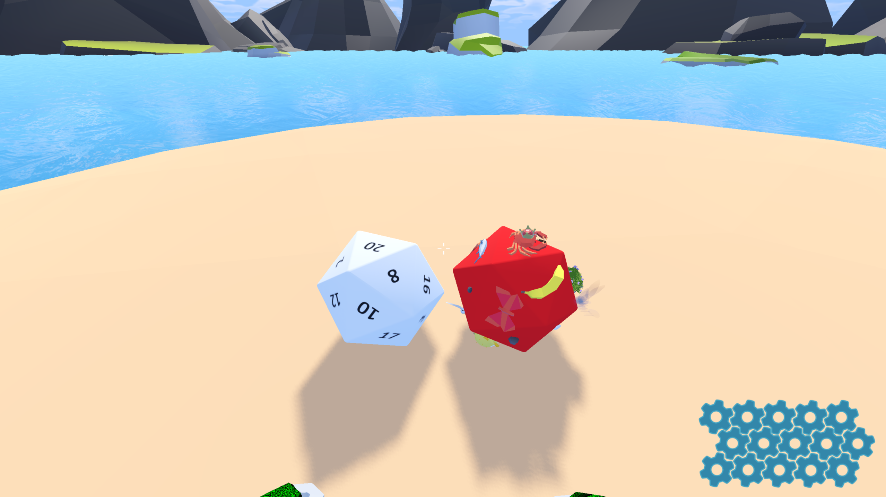

# Dice System

The core mechanic of the game: dynamic dice that control spawning enemies, crafting materials, and more.

## Features
- Variable side counts (D6, D20)
- Server based dynamic side Replacement
- Add's more spawnable enemies and crafts as the player progresses

This system acts as the game’s primary director, balancing chaos with
player readability.

  
  

