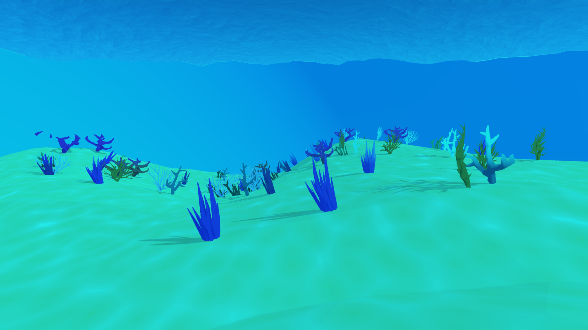

# Shaders

A small collection of cosmetic and environmental shaders used to add motion
and visual identity without impacting gameplay logic.

## Included Shaders
- **Matrix Cosmetic Shader** – Stylized scrolling code robot cosmetic
- **Coral Waving Shader** – Vertex-based motion to simulate underwater sway using TIME

These shaders are lightweight, parameter-driven, and designed to be reused.

  
  

