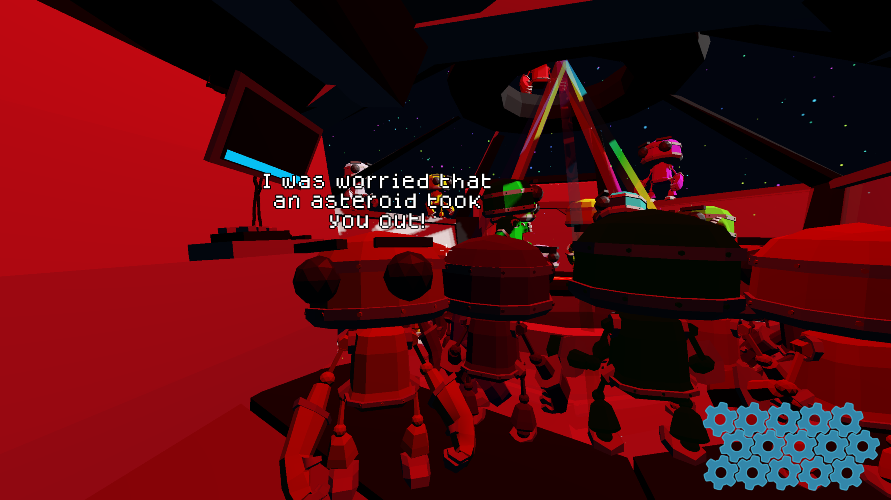
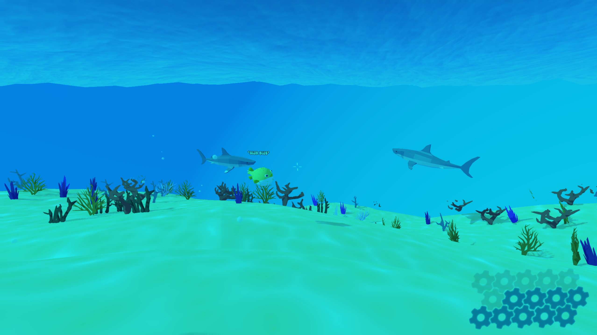

# Dialog System

A lightweight dialog system used to display contextual speech directly
above characters during gameplay.

## Features
- Dialog anchored to world-space entities
- Central dialog manager for timing and cleanup
- Supports multi-line dialog and sequencing
- Designed to avoid pausing gameplay

Used for enemy taunts, story beats, and environmental storytelling.

  
  

