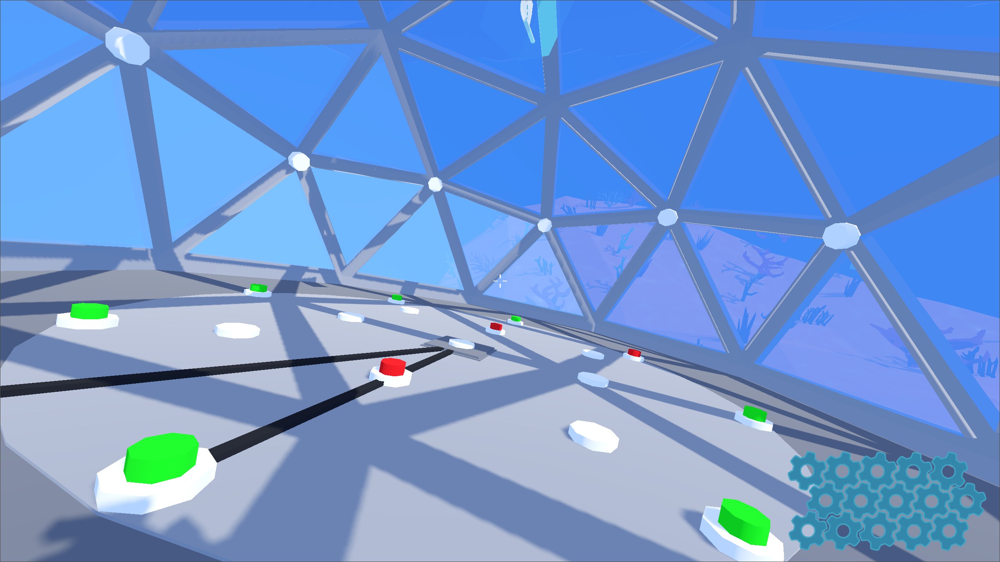
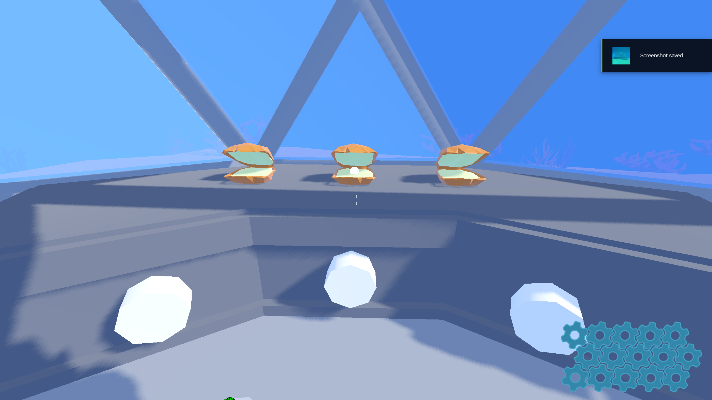
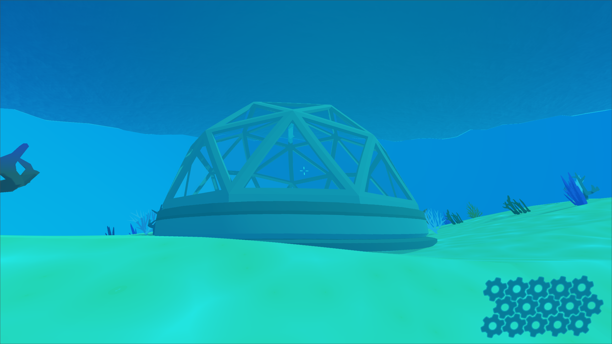

# Puzzles

Self-contained puzzle systems designed to test player logic, timing,
and spatial reasoning.

## Included Puzzles
- **Clam Swap Puzzle** – Position-based logic puzzle with state validation
- **Pearl Collection Time Trials** – Route optimization under time pressure
- **Button / Dome Puzzle** – Trigger-based interaction puzzle with visual feedback

Each puzzle is implemented as a modular system that can be reused or extended.

  
  
  

